# 部署文档：高校心理咨询预约与匿名交流平台

项目总览文档：[README.md](README.md)

开发环境：`Intellij IDEA 2024.2.4`

数据库：`MySQL 8.0.39`

Java：`Java 17`

NodeJS：`NodeJs 22.19.0` `Npm 10.9.3`

Git：`Git 2.45.2`

### 下载Git

**下载地址：**`Git - Downloading Package (git-scm.com)`

**不懂可看：** [https://www.bilibili.com/video/BV1FE411P7B3/?share_source=copy_web&vd_source=a47337438b0319bed538b5c9401a02fc](https://www.bilibili.com/video/BV1FE411P7B3/?share_source=copy_web&vd_source=a47337438b0319bed538b5c9401a02fc)

**安装git**

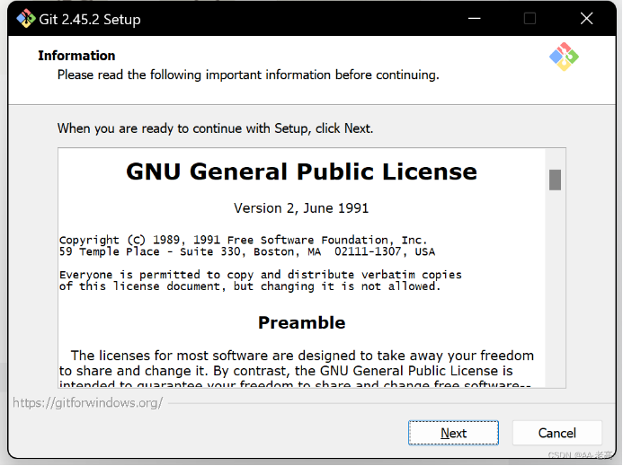
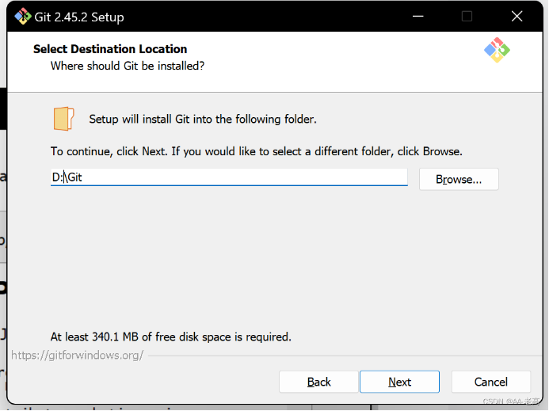
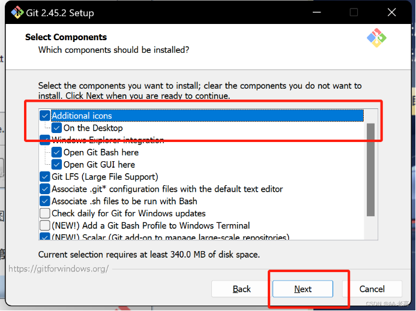
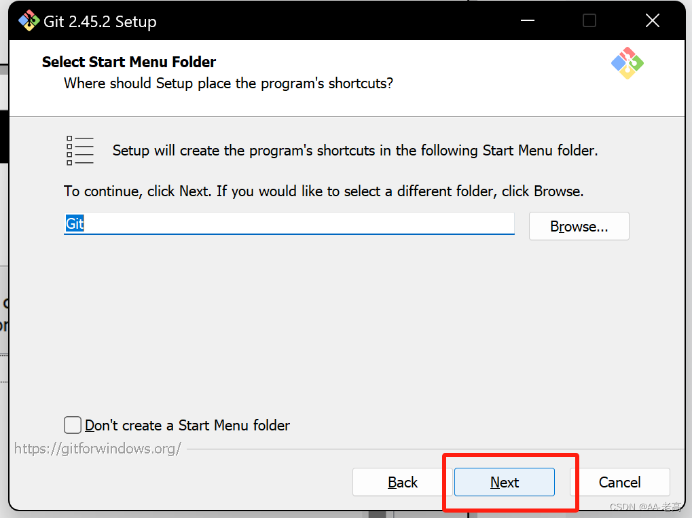


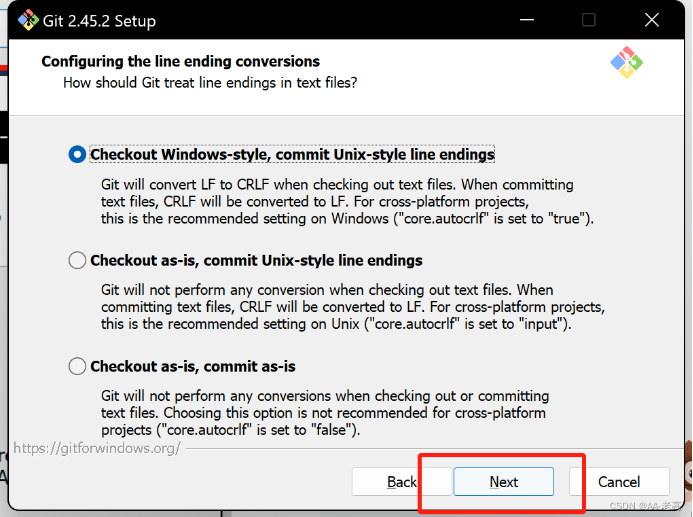
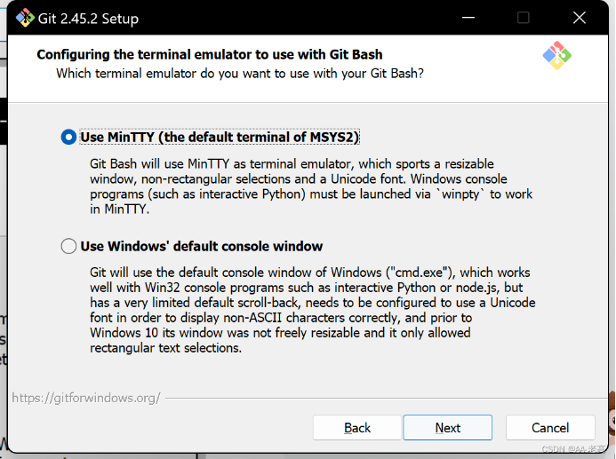
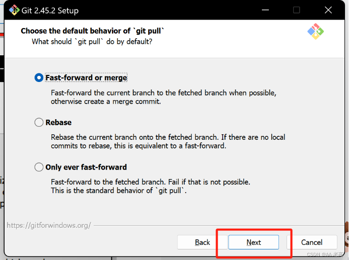


**配置用户名和密码**

```shell
git config --global user.name "注册名"
git config --global user.email "邮箱"
```

**常用指令**

`git config --global user.name xxx`：设置全局用户名，信息记录在`~/.gitconfig`文件中

`git config --global user.email xxx@xxx.com`：设置全局邮箱地址，信息记录在`~/.gitconfig`文件中

`git init：`将当前目录配置成`git`仓库，信息记录在隐藏的`.git`文件夹中

`git add XX：`将`XX`文件添加到暂存区

`git add .：`将所有待加入暂存区的文件加入暂存区

`git rm --cached XX：`将文件从仓库索引目录中删掉

`git commit -m `“给自己看的备注信息”：将暂存区的内容提交到当前分支

`git status：`查看仓库状态

`git diff XX：`查看XX文件相对于暂存区修改了哪些内容

`git log：`查看当前分支的所有版本

`git reflog：`查看HEAD指针的移动历史（包括被回滚的版本）

`git reset --hard HEAD^ `或` git reset --hard HEAD~：`将代码库回滚到上一个版本

`git reset --hard HEAD^^：`往上回滚两次，以此类推

`git reset --hard HEAD~100：`往上回滚100个版本

`git reset --hard 版本号：`回滚到某一特定版本

`git checkout — XX或git restore XX：`将XX文件尚未加入暂存区的修改全部撤销

`git remote add origin git@git.acwing.com:xxx/XXX.git：`将本地仓库关联到远程仓库

`git push -u (第一次需要-u以后不需要)：`将当前分支推送到远程仓库

`git push origin branch_name：`将本地的某个分支推送到远程仓库

`git clone git@git.acwing.com:xxx/XXX.git：`将远程仓库XXX下载到当前目录下

`git checkout -b branch_name：`创建并切换到branch_name这个分支

`git branch：`查看所有分支和当前所处分支

`git checkout branch_name：`切换到branch_name这个分支

`git merge branch_name：`将分支branch_name合并到当前分支上

`git branch -d branch_name：`删除本地仓库的branch_name分支

`git branch branch_name：`创建新分支

`git push --set-upstream origin branch_name：`设置本地的branch_name分支对应远程仓库的branch_name分支

`git push -d origin branch_name：`删除远程仓库的branch_name分支

`git pull：`将远程仓库的当前分支与本地仓库的当前分支合并

`git pull origin branch_name：`将远程仓库的branch_name分支与本地仓库的当前分支合并

`git branch --set-upstream-to=origin/branch_name1 branch_name2：`将远程的branch_name1分支与本地的branch_name2分支对应

`git checkout -t origin/branch_name `将远程的branch_name分支拉取到本地

`git stash：`将工作区和暂存区中尚未提交的修改存入栈中

`git stash apply：`将栈顶存储的修改恢复到当前分支，但不删除栈顶元素

`git stash drop：`删除栈顶存储的修改

`git stash pop：`将栈顶存储的修改恢复到当前分支，同时删除栈顶元素

`git stash list：`查看栈中所有元素

**一般的上传操作：**

`git add .`

`git commit -m "内容"`

`git push`

**对于本地新创建的分支上传**

`git add .`

`git commit -m "内容"`

`git push`

三步之后，会有提示使用`git push --set-upstream origin branch_name。`将远程仓库的`branch_name`分支与本地仓库的当前分支合并

关于各个人版本操作系统不同而导致的代码不同的部分，每次上传不要选择这个部分上传。


**初始化仓库**

现创建一个文件夹

在当前目录下执行

`git init`

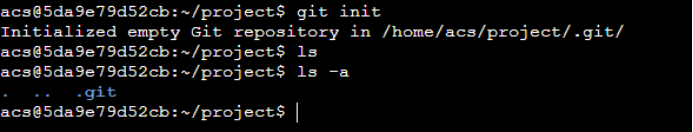

文件夹中多了一个.git的隐藏文件，仓库就创建好了

通过一系列实操熟悉指令

在当前目录下新建一个`readme.md`文件

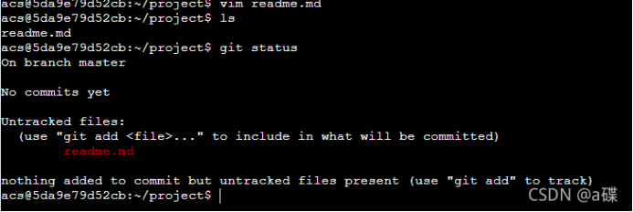

**git status**

查看当前仓库状态，上面说有一个文件没有加入到我们的暂存区中

`git add XX：`将XX文件添加到暂存区

`git add .：`将所有待加入暂存区的文件加入暂存区

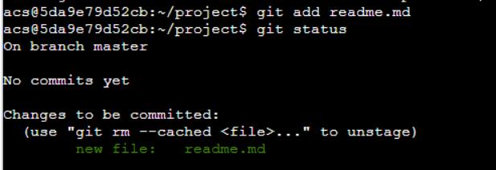

这时，暂存区中已经有一个文件了

`git commit -m `"给自己看的备注信息"：将暂存区的内容提交到当前分支

现在就是将当前版本添加到了主分支里面（该版本只有`readme.md`）

修改一下readme.md文件


在`readme,md中`添加了一行`"222"`
`git status`查看仓库状态如上图所示，当前有一个文件发生了变化


又将修改后的内容放到了暂存区中

如果我们再进行修改，增加一行`“333”`

`git diff XX，`查看XX文件相对于暂存区修改了哪些内容

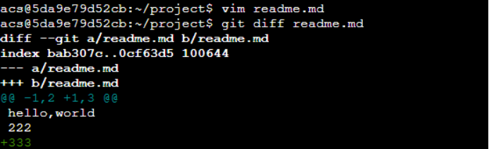

最后执行`git commit -m "add 222 333`

当前分支状态

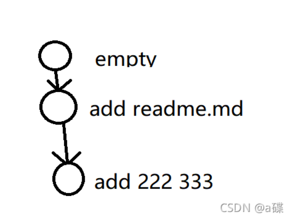

`git restore --staged readme.md`

将暂存区中的文件取出来


### 数据库部署
1、下载并安装`MySQL`，不会的网上找教程

2、在`MySQL WorkBench`中新建名为`ucaacp`的数据库

3、在`backend/src/main/resources/application.properties`中配置你的数据库

```properties
#SQL
spring.datasource.url=jdbc:mysql://localhost:3306/ucaacp?useUnicode=true&characterEncoding=utf8
spring.datasource.username=root
spring.datasource.password=root
```

4、在IDEA上配置好数据库


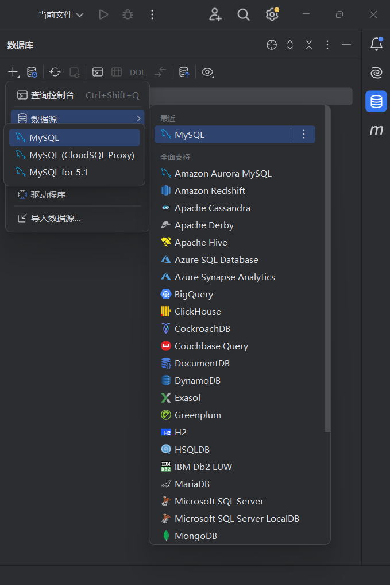


5、运行`database/tables.sql`创建各种表

6、运行`database/datas.sql`添加初始数据

### 后端部署

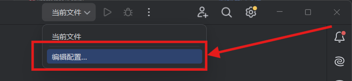


如图

**注意事项：**`backend/src/main/resources/libs/easy-captcha-1.6.2.jar`要添加为库，否则Java编译时可能会报错`找不到com.wf.captcha`
